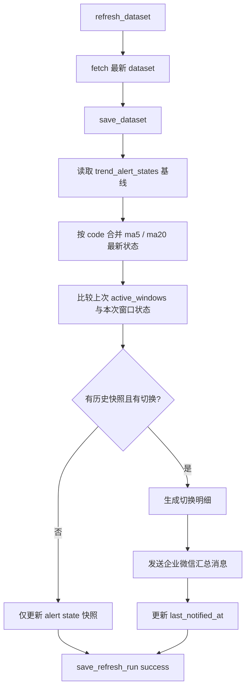

# 均线状态切换企业微信告警设计

## 0. 术语约定

- `均线状态`：某个指数在 `ma5` 或 `ma20` 视图下的最新 `status`，当前代码里只有 `YES` 和 `NO` 两种取值。防冲突结论：继续沿用 `backend/fetcher.py` 生成的 `status` 命名，不引入 `bullish/bearish` 之类新术语。
- `状态切换`：同一指数、同一均线窗口，在本次刷新与上次已持久化快照之间发生 `YES -> NO` 或 `NO -> YES`。防冲突结论：这里特指“窗口级状态变化”，不等同于当前代码里的“进入告警态”。
- `基线快照`：`trend_alert_states` 表里记录的上一次均线状态摘要，用来和本次刷新结果比较。假设：首次建立基线时只写快照不发通知。
- `切换明细`：一次刷新里，某个指数在 `ma5` / `ma20` 上实际发生的方向变化列表，例如 `ma5 YES->NO`、`ma20 NO->YES`。防冲突结论：后续消息文案和测试都围绕“切换明细”组织，不再只说“命中均线”。

## 1. 决策与约束

### 需求摘要

- 做什么：把现有“任一均线进入 NO 才通知”的规则，改成“`ma5` 或 `ma20` 只要发生 `YES↔NO` 切换就通知”。
- 为谁：盘中依赖企业微信机器人跟踪均线状态变化的使用者。
- 成功标准：一次刷新中，若某个指数的 `ma5` 或 `ma20` 相比上一次快照发生切换，就在企业微信汇总消息中出现，并明确写出窗口名与方向。
- 明确不做什么：
  - 不新增邮件或其他通知通道。
  - 不回扫历史数据补发首次快照之前的状态变化。
  - 不把持续不变的状态重复推送。
  - 不改前端页面展示或增加手动告警入口。

### 复杂度档位

走后端小范围规则调整的默认档位，无偏离。

### 关键决策

- 决策 1：通知触发条件改为“窗口级切换”，不再使用“是否进入任一 NO”作为唯一触发器。
  - 原因：用户现在关心的是状态方向变化，而不是仅关心进入 NO。
- 决策 2：沿用 `trend_alert_states.active_windows` 作为上次快照的来源，不新增第二张历史表。
  - 原因：`active_windows` 已能表达“上一轮哪些窗口为 NO”，足以推导 `YES/NO` 的前后变化。
- 决策 3：首次建立基线不发送消息，只在有可比较的上次快照后发送切换通知。
  - 原因：首次部署或清库后如果直接把当前状态全部当作变化，会制造一波无意义噪音。
- 决策 4：同一次刷新继续合并成一条企业微信 markdown 消息，但明细项从“命中窗口”改成“切换窗口 + 方向”。
  - 原因：保留当前汇总通知形式，降低对现有使用习惯和消息频率的扰动。
- 决策 5：通知发送失败仍然显式抛错并记 `refresh_run` 失败。
  - 原因：沿用现有“失败暴露”原则，避免把状态变更静默吞掉。

## 2. 名词与编排

### 2.1 名词层

#### 现状

- `backend/models.py::TrendAlertState` 记录 `rule_key / code / is_active / active_windows / last_entered_at / last_notified_at / updated_at`，语义偏向“当前是否处于任一 NO 告警态”。
- `backend/models.py::TriggeredAlertItem` 只包含 `active_windows` 与 `active_window_label`，消息里表达的是“当前哪些均线命中 NO”，没有方向信息。
- `backend/repository.py::trend_alert_states` 表只持久化 `active_windows`，没有单独保存 `ma5_status` / `ma20_status` 字段。

#### 变化

- 保留 `TrendAlertState.active_windows` 作为基线快照表达，但语义从“当前告警态窗口集合”扩展为“上次刷新时为 NO 的窗口集合”。
- 扩展 `TriggeredAlertItem` 或等价的消息输入结构，使其能表达：
  - `changed_windows`：发生切换的窗口列表
  - `change_labels`：例如 `ma5 YES->NO`、`ma20 NO->YES`
  - `status_started_at`：对 `YES->NO` 取当前窗口的 `statusChangedAt`，对 `NO->YES` 取当前窗口的 `statusChangedAt` 作为“本轮新状态起点”
- `is_active` 继续表示“本轮是否存在至少一个 NO”，但它不再决定是否发通知，只作为快照冗余字段保留。

#### 接口示例

```python
# 来源：backend.alert_service evaluate_status_transition_alerts
{
    'code': '000001',
    'name': '上证指数',
    'close': 3120.55,
    'changedWindows': ['ma5', 'ma20'],
    'changeLabels': ['ma5 YES->NO', 'ma20 NO->YES'],
    'statusStartedAt': '2026-05-06',
}
```

```python
# 来源：backend.repository TrendAlertState
TrendAlertState(
    rule_key='any_ma_no',
    code='000001',
    is_active=True,
    active_windows=('ma5',),
    last_entered_at='2026-05-06 10:00:00',
    last_notified_at='2026-05-06 10:00:00',
    updated_at='2026-05-06 10:10:00',
)
```

### 2.2 编排层



#### 现状

- `backend/service.py::TrendDashboardService.refresh_dataset` 在保存 `dataset` 后调用 `AnyMaNoAlertService.evaluate_and_persist`。
- `backend/alert_service.py::evaluate_any_ma_no_alerts` 只判断“本轮是否有任一窗口为 NO”以及“是否从非激活态进入激活态”。
- `backend/alert_service.py::format_message` 只输出“命中 ma5 / ma20 / ma5 + ma20”，不区分 `YES->NO` 还是 `NO->YES`。

#### 变化

- 刷新流程入口不变，仍在 `save_dataset` 之后做告警比较。
- 规则判定函数改为“比较上次窗口快照与本次窗口快照”：
  - 上次 `active_windows` 含某窗口，本次不含：该窗口发生 `NO->YES`
  - 上次不含某窗口，本次含：该窗口发生 `YES->NO`
  - 上下两次都含或都不含：该窗口无变化
- 仅当存在“已知上次快照”且至少一个窗口发生变化时，才把该指数加入本次通知列表。
- `format_message` 改为输出切换明细，例如 `切换 ma5 YES->NO` 或 `切换 ma5 YES->NO, ma20 NO->YES`。

#### 流程级约束

- 首次快照不通知：没有 `existing_states[code]` 时，只落基线。
- 发送失败仍视为刷新失败：`dataset` 与快照已保存，`last_notified_at` 不更新。
- 同一次刷新同一指数可携带多个窗口变化，但只占汇总消息一条明细。
- 切换判断只依赖最近一次快照，不做多步历史重建。

### 2.3 挂载点清单

- 刷新主流程：`backend/service.py::TrendDashboardService.refresh_dataset` — 修改
- 告警规则服务：`backend/alert_service.py::AnyMaNoAlertService` — 修改
- 告警状态持久化：`backend/repository.py::trend_alert_states` — 修改
- 企业微信机器人消息文案：`backend/notifiers/wecom.py` 的调用输入 — 修改

### 2.4 推进策略

1. 规则骨架：把告警判定从“进入任一 NO”改成“比较上次窗口快照与本次状态”
   退出信号：规则测试能区分 `YES->NO`、`NO->YES` 和“无变化”
2. 消息输入结构：为触发项补齐切换明细与方向文案
   退出信号：消息格式化测试里能看到 `ma5 YES->NO` / `ma20 NO->YES`
3. 刷新流程接入：保持现有 `save_dataset -> compare -> notify -> save_refresh_run` 顺序
   退出信号：服务集成测试证明一次刷新只发一条汇总消息，且失败路径仍写 `refresh_run failed`
4. 测试收尾：覆盖首次基线、双窗口同时切换、持续不变不通知
   退出信号：后端相关测试全部通过

### 2.5 结构健康度与微重构

##### 评估

- 文件级 — `backend/alert_service.py`：当前约 100 行，已经同时承担“规则比较”和“消息格式化”两件强相关职责；本次变更继续落在这两个职责范围内，改动集中且彼此直接相关。
- 文件级 — `backend/service.py`：约 80 行，刷新流程仍然单一，告警接入点明确，不需要再拆额外 orchestration。
- 文件级 — `backend/repository.py`：约 240 行，虽然偏长，但本次只改 alert state 的读写语义，不新增第二类持久化责任。
- 目录级 — `backend/notifiers/`：当前只有 `wecom.py`，目录不拥挤；本次不新增新文件。
- 目录级 — `backend/tests/`：当前测试文件数量少，本次只是在现有 alert/service 测试上扩展。

##### 结论：不做

- 原因：这次是规则语义调整，不涉及跨模块职责漂移；现有文件虽然有一定长度差异，但还没到需要先做“只搬不改行为”微重构的程度。

## 3. 验收契约

- 输入：上次快照 `active_windows=()`，本次 `ma5=NO`、`ma20=YES`
  → 期望：不发送通知，建立基线快照
- 输入：上次快照 `active_windows=()`，本次 `ma5=NO`
  → 下次刷新 `ma5=YES`
  → 期望：发送一条包含 `ma5 NO->YES` 的明细
- 输入：上次快照 `active_windows=('ma20',)`，本次 `ma20=NO`
  → 期望：不发送通知
- 输入：上次快照 `active_windows=('ma5',)`，本次 `ma5=YES`、`ma20=NO`
  → 期望：发送一条明细，包含 `ma5 NO->YES` 与 `ma20 YES->NO`
- 输入：一次刷新内多个指数分别发生窗口切换
  → 期望：企业微信只发一条汇总消息，数量与明细条数一致
- 输入：企业微信发送失败
  → 期望：刷新记录为失败，`last_notified_at` 不更新，但 dataset 和最新快照已经写入

### 明确不做的反向核对项

- 代码中不应继续把“`entered_codes` 非空”当作唯一通知条件。
- 消息文案不应只出现“命中 ma5 / ma20”，必须包含方向信息。
- 首次建立快照时不应发送企业微信通知。

## 4. 与项目级架构文档的关系

- 这是后端内部告警规则的调整，系统级入口、前端路由、数据库主模型都不变。
- acceptance 阶段若这套“窗口状态切换通知”被确认会长期保留，建议在 `ARCHITECTURE.md` 的“已知约束 / 硬边界”里补一条：主看板告警只在刷新后依据上次快照比较触发，不做历史补发。
- 当前无需新增新的架构子文档。
